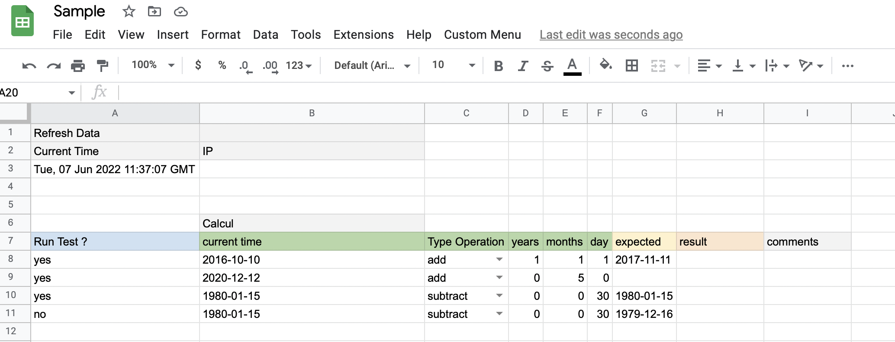
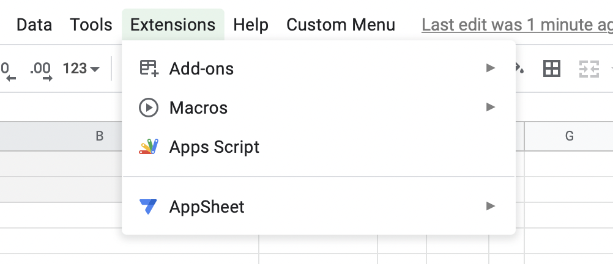
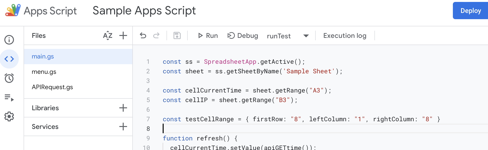
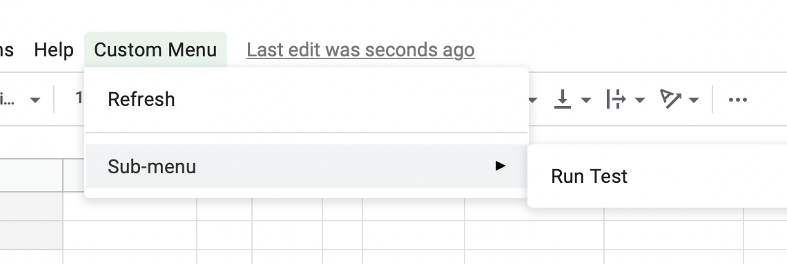

# google-apps-script-samples

Sample Google Sheets and Google Apps Scripts to test API  

The purpose of this, is to allow a non-technical person to run API tests from a tool well-known, easy to custom and without specific things to install. There is also a trigger feature which can be used to run tests at a chosen time.

 

## 🏗️ Install

- In a new Google Sheet, **File -> import** file [Sample.xlsx](Sample.xlsx)
- Then in **Extensions -> Apps Scripts**

Copy code from [app-scripts/*](app-script/) like this:

## 🚀 Run Tests
To run tests, we have created a custom menu.

- You can click on **Custom Menu -> Refresh** to update cells "A3" and "B3" 
- You can click on **Custom Menu -> Sub-Menu ->  Run Test** to run tests, here it's just a date calcul and a comparaison with an expected value.

**!!** You must accept Google permissions to execute code **!!**

## 📖 Code Structure

In this sample project, we only write 3 files:
- [**apps-script/APIRequest.gs**](apps-script/APIRequest.gs)  
Define API requests, we use [Postman Echo](https://www.postman.com/postman/workspace/published-postman-templates/documentation/631643-f695cab7-6878-eb55-7943-ad88e1ccfd65?ctx=documentation).
- [**apps-script/menu.gs**](apps-script/menu.gs)  
Define the custom menu.
- [**apps-script/main.gs**](apps-script/main.gs)  
Main script where we write test scripts.

## 🔗 Links

- [doc Google UrlFetchApp](https://www.google.com/url?sa=t&rct=j&q=&esrc=s&source=web&cd=&cad=rja&uact=8&ved=2ahUKEwjtwfnHsJv4AhUAhc4BHbNPDV0QFnoECAoQAQ&url=https%3A%2F%2Fdevelopers.google.com%2Fapps-script%2Freference%2Furl-fetch%2Furl-fetch-app&usg=AOvVaw1es4UXFlVMQZcqwJ_TVhvI)
- [doc Postman Echo](https://www.postman.com/postman/workspace/published-postman-templates/documentation/631643-f695cab7-6878-eb55-7943-ad88e1ccfd65?ctx=documentation)